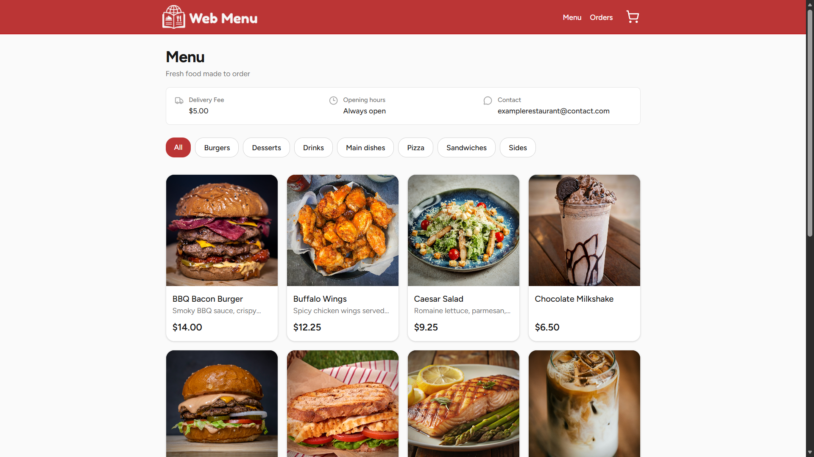
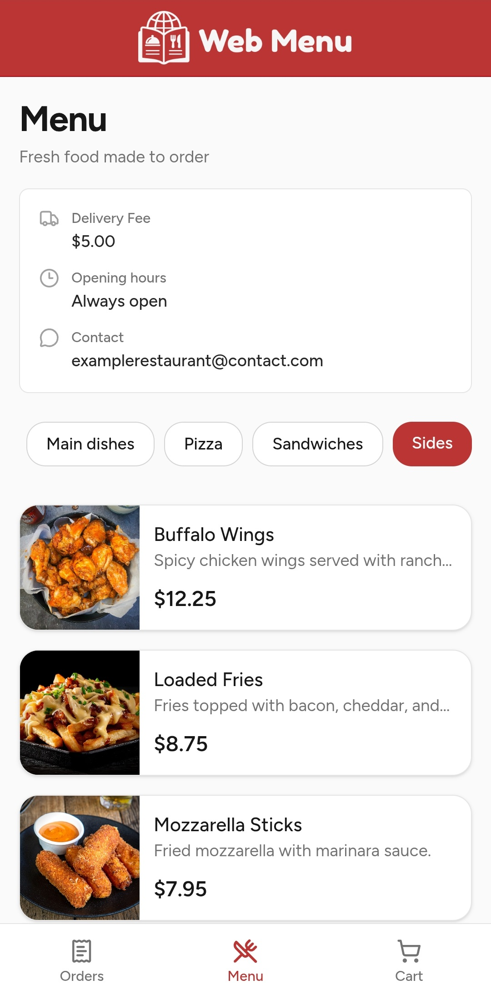
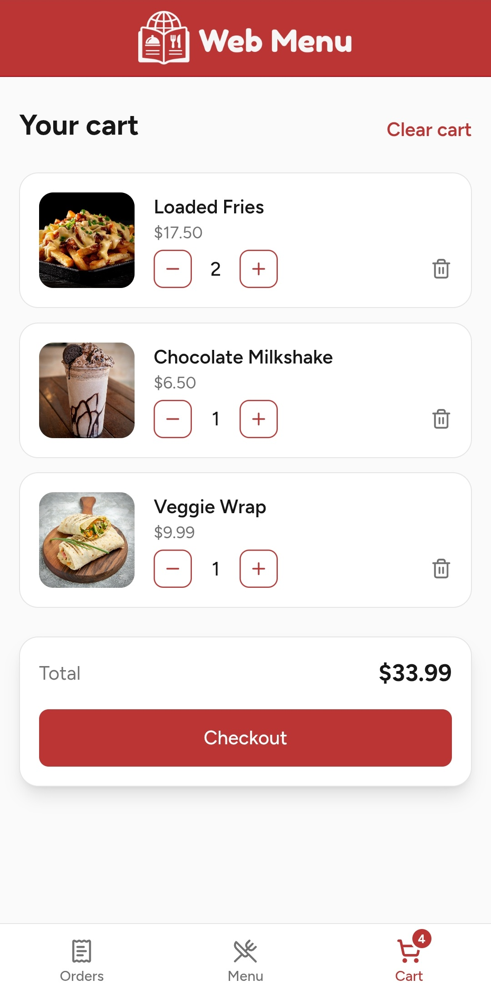
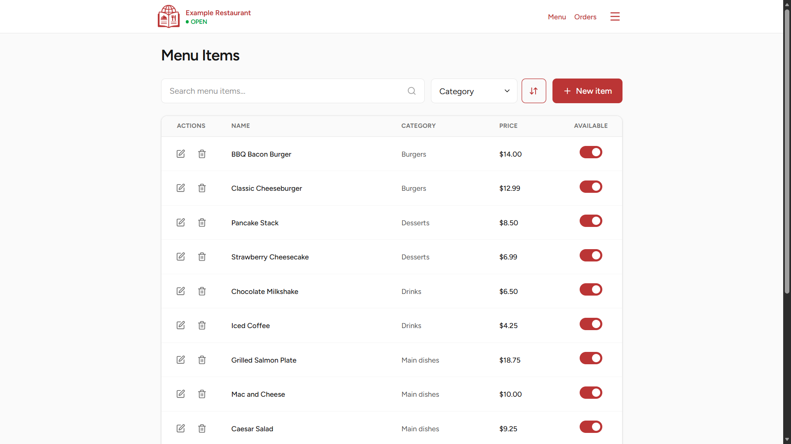
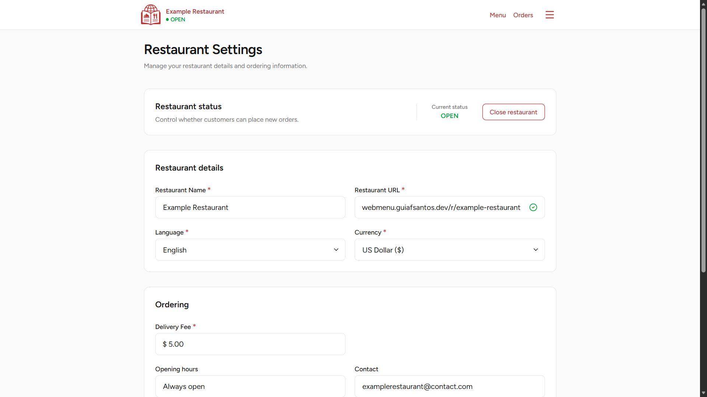
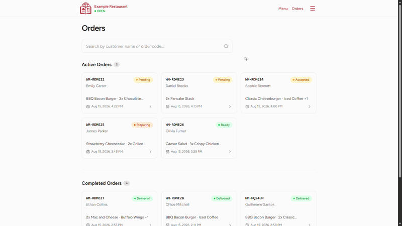

# Web Menu

A full-stack digital menu and order management application for restaurants.

Web Menu gives restaurants a public menu where customers can browse items, place delivery orders without creating an account, and track their orders, alongside a private management area for maintaining the menu and handling incoming orders.

**English** | [Português Brasileiro](./README.pt-BR.md)

🔗 [Web Menu](https://webmenu.guiafsantos.dev/) · [Example Restaurant](https://webmenu.guiafsantos.dev/r/example-restaurant)

> The example restaurant can be used to explore the customer-facing experience. To try the restaurant management features, create your own restaurant from the main application.

## Features

### Customer

- Browse menu items by category
- View item details and availability
- Add items to a persistent cart and manage quantities
- Place delivery orders without creating an account
- Choose a payment method, with change requests for cash payments
- Track orders using a unique order code
- Receive updated order statuses as the restaurant processes an order
- Responsive interface with dedicated mobile navigation
- Restaurant availability handling, preventing orders while the restaurant is closed

### Restaurant management

- Create, edit, delete, and categorize menu items
- Mark individual items as available or unavailable
- View active and completed orders
- Access customer, delivery, payment, and order information
- Advance orders through their processing workflow
- Cancel active orders
- Open or close the restaurant to new orders
- Configure restaurant information, delivery fee, opening hours, and contact details
- Customize the restaurant's public URL
- Configure language and currency
- Copy or open the public restaurant menu directly from the management area

## Screenshots

### Customer menu

<p align="center">
  
</p>

### Mobile

<p align="center">
  
  
</p>

### Restaurant management

<table>
  <tr>
    <td width="50%" align="center">
      
      <br />
      <sub>Manage menu items, categories, and availability.</sub>
    </td>
    <td width="50%" align="center">
      
      <br />
      <sub>Configure restaurant information, language, currency, and other settings.</sub>
    </td>
  </tr>
</table>

## Order management

Orders move through a defined workflow from placement to delivery:

`Pending → Accepted → Preparing → Ready → Delivered`

Active orders are kept separate from delivered and cancelled orders, making the orders page focused on what currently needs attention. Status changes are made through a press-and-hold interaction to help prevent accidental updates.

<p align="center">
  
</p>

## Localization

Web Menu is available in **English** and **Brazilian Portuguese**, with language configured individually for each restaurant.

Restaurant-authored content, such as menu item names, descriptions, opening hours, and contact information, remains exactly as entered rather than being automatically translated.

Currency is also configured per restaurant, with prices formatted according to the selected currency and current language.

## Tech stack

- Next.js
- TypeScript
- Tailwind CSS
- Prisma ORM
- PostgreSQL
- Headless UI

## Running locally

### Prerequisites

- Node.js
- pnpm
- PostgreSQL

### Clone the repository

```bash
git clone git@github.com:oguiaugusto/web-menu.git
cd web-menu
```

### Environment variables

Create a `.env` file in the project root:

```env
DATABASE_URL="your-postgresql-connection-string"
JWT_SECRET="your-jwt-secret"
CRON_SECRET="your-cron-secret"
```

### Setup

Install the dependencies:

```bash
pnpm install
```

Run the database migrations:

```bash
pnpm prisma migrate deploy
```

Start the development server:

```bash
pnpm dev
```

The application will be available at `http://localhost:3000`.

## About

Web Menu was inspired by the ordering experience of small local restaurants and businesses that often rely on messaging apps and other informal ways of sharing menus and receiving orders.

The project explores a more structured version of that workflow while keeping the customer experience simple: open a restaurant's menu, choose what you want, place an order, and follow its progress. On the other side, the restaurant gets a focused interface for maintaining the menu and managing those orders from receipt to delivery.

It was also built as an opportunity to work with Next.js as a full-stack framework, particularly its App Router, Server Components, Server Actions, and the separation between public customer flows and authenticated management features.

## License

This project is licensed under the [MIT License](./LICENSE).
